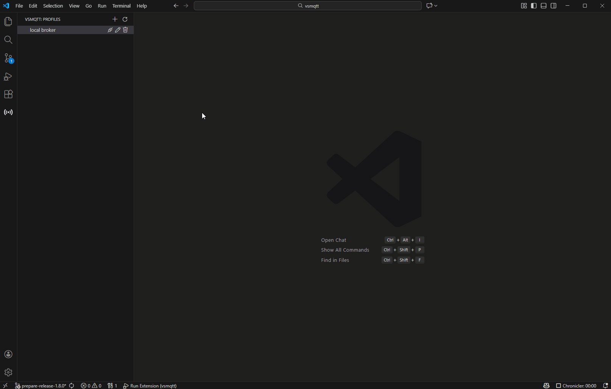

# VSMQTT

Vsmqtt is a simple MQTT client integrated in vscode.

## Features

Existing features:

* Create and use multiple mqtt profiles
* Connect to broker
* Publish messages to mqtt brokers
* Subscribe to topics
* Browse details of received messages 

Future features:

* Connect to multiple brokers simultaneously
* Support for websocket connection
* Support for secure connection
* Colors to differentiate messages by topics
* Pin topics (pinned topics will be saved to profiles and will be used to subscribe to automatically upon connection)

## Extension Settings

This extension stores mqtt broker profiles in workspace settings.json under: `"vsmqtt.brokerProfiles"`.

## Commands

| Name               | Description                       |
|--------------------|-----------------------------------|
| addProfile         | Create new mqtt broker profile    |
| editProfile        | Edit existing mqtt broker profile |
| deleteProfile      | Delete mqtt broker profile        |
| connectToBroker    | Connect to broker                 |
| refreshProfileList | Refresh sidebar view              |

All commands can be invoked also from the ui.

