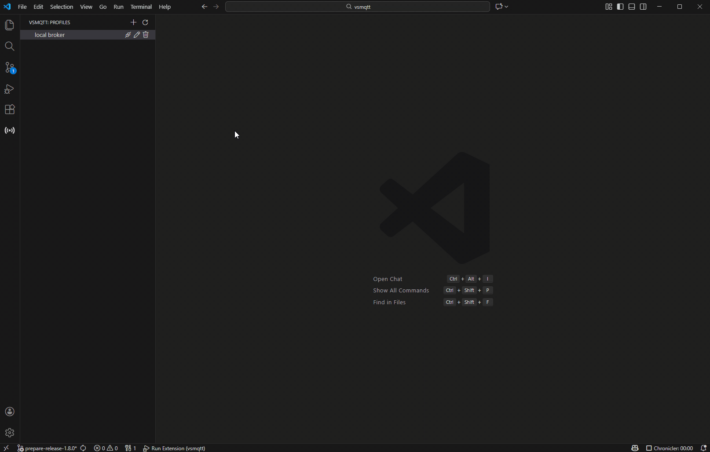

# VSMQTT

[](https://marketplace.visualstudio.com/items?itemName=rpdswtk.vsmqtt)
[](https://marketplace.visualstudio.com/items?itemName=rpdswtk.vsmqtt)


<a href="https://www.buymeacoffee.com/rpdswtk" target="_blank"></a>

Vsmqtt is a simple MQTT client integrated in vscode.



## Features

* Create and use multiple mqtt profiles
* Connect to broker
* Support for secure connection
* Publish messages to mqtt brokers
* Subscribe to topics
* Browse details of received messages
* Connect to multiple brokers simultaneously
* Colors to differentiate messages by topics
* Pin topics (pinned topics are saved to settings and are used to subscribe to automatically upon connection)
* Export to csv
* Support for websocket connection
* Clear retained messages
* Right click on message to open in text edior
* Save/load default topic, payload, qos and retain values for publish section on UI

## Extension Settings

By default, this extension stores MQTT broker profiles in workspace `settings.json` under: `"vsmqtt.brokerProfiles"`.

You can configure where profiles are saved using the `"vsmqtt.profileStorageTarget"` setting. Note that this setting has a **machine scope** (it cannot be overridden at the workspace level, preventing a workspace configuration from shadowing your preferred global target).

### Storage Target Settings:

* **`vsmqtt.profileStorageTarget`**:
  * `"workspace"` (default): Stores broker profiles in the Workspace Settings (`.vscode/settings.json`). Scoped to this project only.
  * `"user"`: Stores broker profiles in the User Settings. Available across all workspaces and synced via Settings Sync.

When switching storage targets, the extension will automatically detect leftover profiles in the other scope and prompt you to migrate them (preserving non-overlapping profiles and letting you choose how to resolve conflicts).

### Configuration properties:

| name      | type   | description                                                       | required |
|-----------|--------|-------------------------------------------------------------------|----------|
| profileStorageTarget | string | Extension setting. Specifies where broker profiles are persisted: `"workspace"` (default) or `"user"`. | - |
| name      | string | Profile name                                                      |     -    |
| host      | string | Broker host                                                       |     -    |
| port      | number | Broker port                                                       |     -    |
| path      | string | Broker path                                                       |     -    |
| username  | string | Client username                                                   |          |
| password  | string | Client pasword                                                    |          |
| promptCredentials  | boolean | Ask for username and password before connecting to the broker |          |
| protocol  | string | "mqtt", "mqtts", "tcp", "tls", "ws", "wss"                        |          |
| ca        | string | Absolute path for cert file or cert string in PEM format          |          |
| key       | string | Absolute path for client cert file or cert string in PEM format   |          |
| cert      | string | Absolute path for client key file or cert string in PEM format    |          |
| clientId  | string | Client ID                                                         |          |
| keepalive | number | Keepalive interval in seconds.                                    |          |
| insecure  | boolean | Disable verification of the server hostname in the server certificate. This option makes it possible for a malicious third party to impersonate your server through DNS spoofing. Use it in testing environment only.                                    |          |
| rejectUnauthorized | boolean | Skip server certificate validation                                |          |
| unixSocket | boolean | Connect to unix socket                                            |          |
| savedSubscriptions | array | Array of saved subscriptions, each object with topic (string) and qos (number: 0, 1, or 2) |          |
| defaultsForPublish | object | Defaults for publish: topic (string), payload (string), qos (number: 0, 1, or 2, default 0), retain (boolean, default false). This is used for populating publish part on UI |          |

### Examples:

Password protected connection:
```json
{
    "name": "client with password",
    "host": "localhost",
    "port": 1884,
    "username": "user01",
    "password": "securepassword"
}
```

Connecting to TLS protected broker:
```json
{
    "name": "client with tls",
    "host": "broker.emqx.io",
    "port": 8883,
    "protocol": "mqtts",
    "ca": "/path_to_crt"
}
```

Connecting to broker using websocket:
```json
{
    "name": "broker.emqx.io",
    "host": "ws://broker.emqx.io",
    "port": 8083,
    "clientId": "vsmqtt_client_test",
    "protocol":"ws",
    "path": "/mqtt"
}
```

Connecting to unix socket
```json
{
    "name": "unix connection",
    "protocol": "mqtt",
    "path": "/var/run/mosquitto/mosquitto.sock",
    "unixSocket": true
}
```

## Commands

| Name               | Description                       |
|--------------------|-----------------------------------|
| addProfile         | Create new mqtt broker profile    |
| editProfile        | Edit existing mqtt broker profile |
| deleteProfile      | Delete mqtt broker profile        |
| connectToBroker    | Connect to broker                 |
| refreshProfileList | Refresh sidebar view              |

All commands can be invoked also from the ui.

